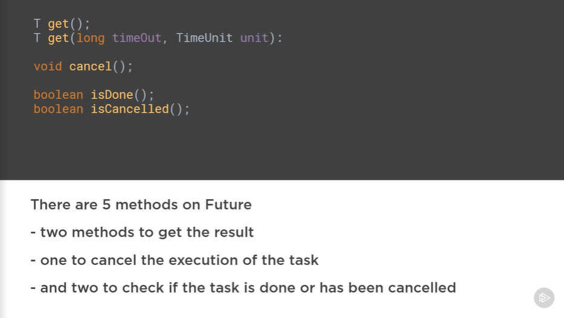
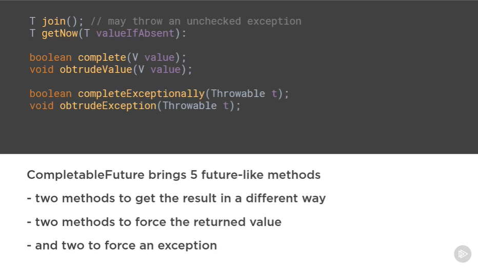
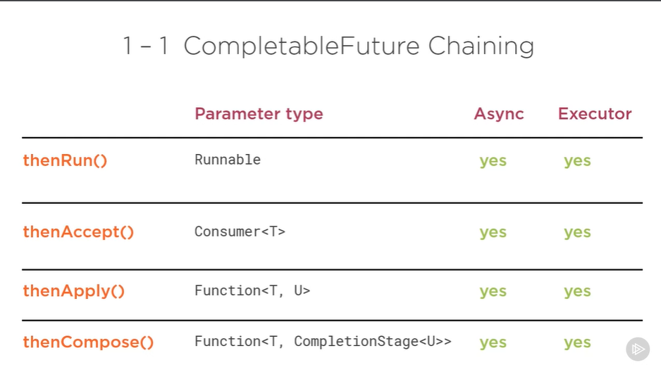
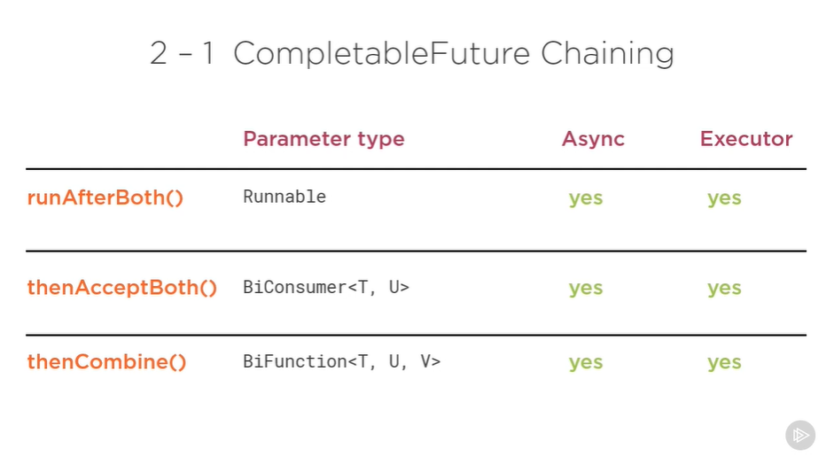
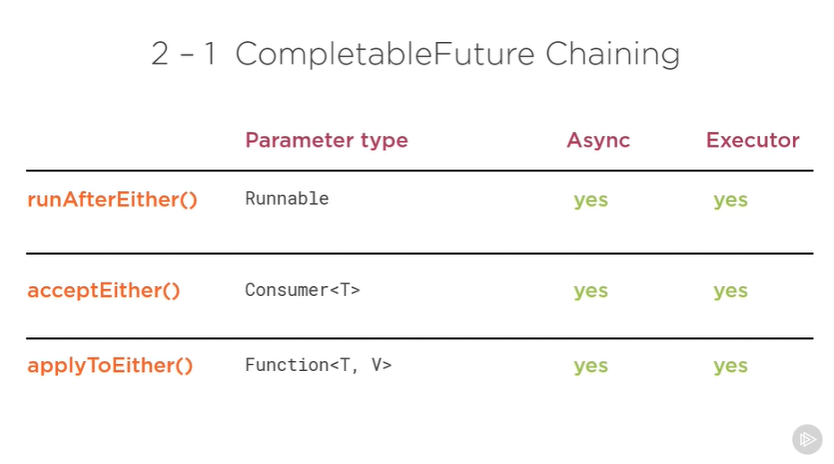
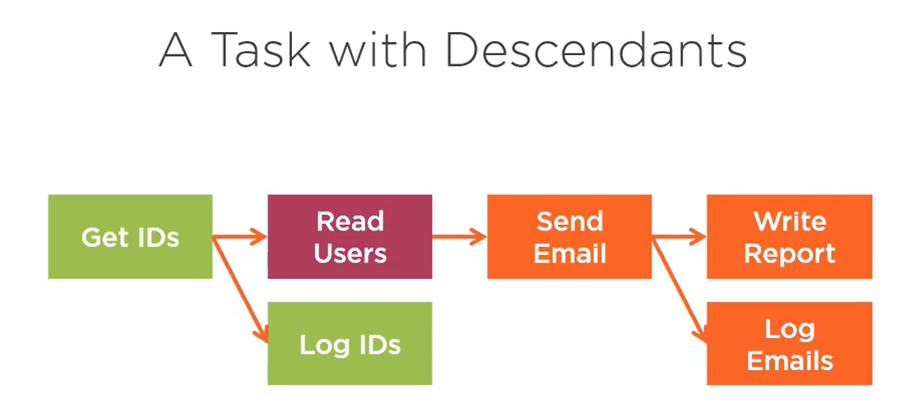

Java Fundamentals Asynchronous Programming Using CompletionStage 
By Jose Paumard
https://github.com/JosePaumard

Other courses
- Applying Concurrency and Multi-threading to common Java patterns
- From collections to Streams in Java 8 using Lamdba expressions
- Streams, Collectors and Optionals for Data processing in Java 8

# Introduction
CompletionStage is a Java interface
CompletionStage API

synchronous vs asynchronous
blocking vs non-blocking

# Chapter 1

# Chapter 2 Introducing Asynchronous vs Concurrent tasks
CompletableStage
CompletableFuture
pipeline of Tasks in a asynchronous way (chaining)
error handling
performance

concurrent programming
lambda expressions
Stream API

Launching a concurrent task
Synchronous vs asynchronous
Blocking vs non-blocking

Use case:
- get ID's from API
- Read Users from database
- Send Email

future.get()  // is a blocking call

Asynchronous and concurrent are different things

Executor API

# Chapter 3 Setting up Asynchronous operations with CompletionStage
CompletionStage API

Task:
Runnable interface
Callable interface

Two patterns:
- Runnable pattern -> since Java 1 this is an obsolete pattern
- Executor pattern -> since Java 5 (get a Future get the returned object or cancel it)

From Future to CompletableFuture
Completable Future does not work with Callables uses Supplier (does not throw a checked Exception) instead

CompletableFuture.runAsync()  // Takes a Runnable
CompletableFuture.supplyAsync()  // Takes a Supplier

- By default, async tasks run in the Common Fork / Join Pool 
- You can also pass an executor

CompletableFuture is a class that implements:
- Future interface
- CompletionStage interface
- 

Task state:
- running
- completed normally
- completed exceptionally

### Future API

### CompletableFuture API

# Chapter 4 Triggering a task on completion of Other tasks
Does chaining a Runnable with a Consumer or a Function make sense -> No, because the Runnable returns void (null)
On the other hand you can chain anything on a Supplier

Important pattern is Completable Future Composition

# Chapter 5 Dealing with exception in the CompletionStage pipeline

3 patterns to handle exceptions:
- exceptionally()
- whenComplete()
- handle()

CF.get()
CF.join()

task:
- runnable
- supplier
- consumer
- function

create pipelines of asynchronous tasks
trigger tasks on the completion of other tasks

